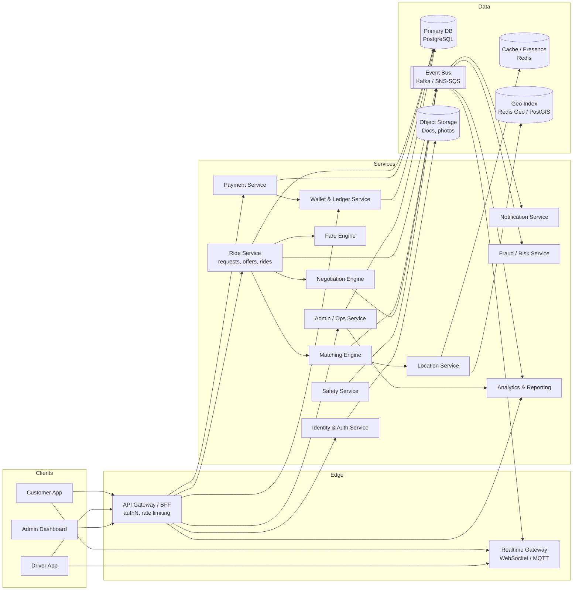
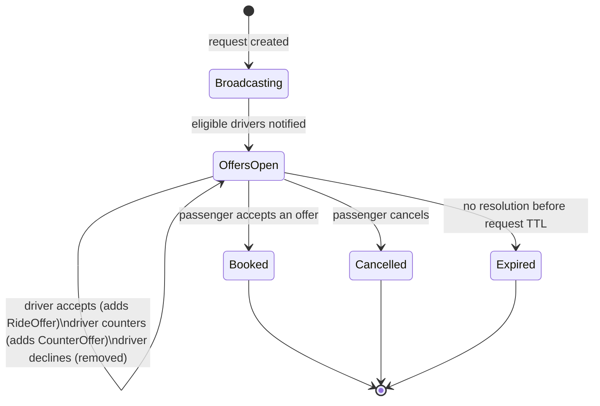
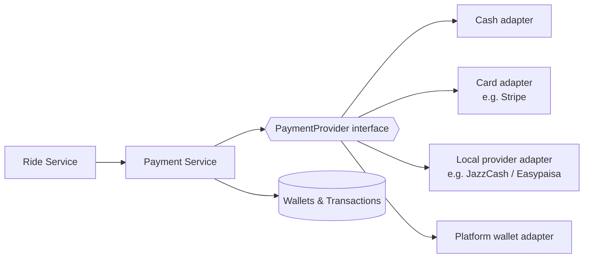
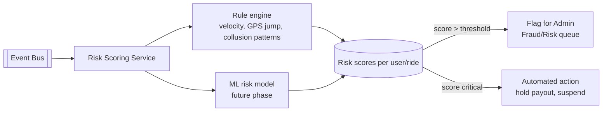

# 06 — Technical Architecture

## 1. System overview



Services are logically separated (as above) but Phase 1/2 can ship as a modular
monolith sharing one Postgres database with clear schema ownership boundaries;
splitting into physically separate services is a scaling decision, not a
day-one requirement — the API and data contracts are designed so that split is
non-breaking later.

## 2. Real-time system

Everything time-sensitive rides on a **publish/subscribe event bus** (Kafka,
SNS/SQS, or Redis Streams — swappable) feeding a **Realtime Gateway** that
fans events out to connected clients over WebSocket (fallback: long polling).

Event types:

| Event | Producer | Consumers |
|---|---|---|
| `driver.location.updated` | Driver app (every 3–5s while online/on-trip) | Location Service, Matching Engine, passenger's Realtime session for their active ride |
| `ride_request.created` | Ride Service | Matching Engine, eligible drivers' Realtime sessions |
| `ride_offer.accepted` | Driver app → Ride Service | Passenger session, Notification Service |
| `counter_offer.created` | Driver app → Negotiation Engine | Passenger session |
| `counter_offer.expired` | Negotiation Engine (timer) | Passenger + driver sessions |
| `ride.status_changed` | Ride Service (arrived/started/completed/cancelled) | Both parties, Admin live map, Analytics |
| `chat.message` | Either app | Counterparty session |
| `notification.created` | Notification Service | Target user's session + push provider |

Design rules:
- Every real-time event is **also** durably persisted (ride_status_history,
  messages, notifications) — the socket layer is a delivery accelerator, not
  the source of truth.
- Clients reconcile on reconnect via a `GET .../rides/{id}` snapshot fetch,
  so missed events during a drop never desync state.
- Driver location updates are geo-indexed (Redis Geo or PostGIS) for
  sub-second "drivers within radius X" queries used by the Matching Engine.

## 3. Matching Engine (Quick Match)

Given a `RideRequest`, score eligible drivers and auto-assign the best one.

**Eligibility filter** (hard constraints, in order):
1. Driver is `online` and not already on a ride.
2. Driver's vehicle type matches the request's vehicle type.
3. Driver is within the request's service zone / max dispatch radius.
4. Driver's account is in good standing (not suspended, verification current).

**Scoring** (weighted, city-configurable weights):
- ETA to pickup (primary factor).
- Distance to pickup.
- Driver acceptance-rate history (deprioritize chronic decliners).
- Driver rating.
- Idle time (fairness — prefer drivers who've waited longer, all else equal).

No input derived from a protected characteristic (name, photo, perceived
identity) is ever a matching input — enforced by construction: the scoring
function only receives the fields listed above.

## 4. Negotiation Engine (Competitive Offer)

State machine per `RideRequest` in Competitive Offer mode:



Rules:
- Passenger's initial proposed fare goes out to all eligible drivers
  simultaneously (fan-out, not sequential).
- A driver **accept** creates a `RideOffer(status=accepted)` at the proposed
  fare — passenger can book it immediately.
- A driver **counter** creates a `CounterOffer` with its own price and an
  **expiry timer** (default 90s, city-configurable). If it expires unanswered,
  status flips to `expired` and the driver is freed to answer other requests.
- Passenger actions on any live offer: **accept**, **keep waiting**, or
  **cancel the whole request**.
- The `RideRequest` itself has a top-level TTL (default 3 min); if unresolved,
  it auto-expires and the passenger is prompted to retry or switch to Quick
  Match.
- All timers are server-owned (not client countdown) so expiry is consistent
  regardless of client connectivity.

## 5. Fare Engine

**Fully data-driven — never hardcoded.** Inputs, all admin-configurable per
city/zone/vehicle-type via the Pricing section of the Admin Dashboard
(see [05](./05-admin-journey.md)):

```
estimated_fare =
    base_fare
  + (distance_km   × per_km_rate)
  + (duration_min  × per_min_rate)
  × demand_multiplier(city, zone, time)
  , clamped to [minimum_fare, maximum_fare]

platform_commission = estimated_fare × commission_rate(city, vehicle_type)
driver_payout        = estimated_fare − platform_commission
```

- `base_fare`, `per_km_rate`, `per_min_rate`, `minimum_fare`, `maximum_fare`,
  `commission_rate` all live in `fare_rules` keyed by `(city_id, vehicle_type_id,
  zone_id?)` — see [08 — Database Schema](./08-database-schema.sql).
- `demand_multiplier` reads live supply/demand from the Location Service
  (drivers online vs. open requests in a zone) — bounded (e.g. 1.0×–2.5×) and
  itself admin-configurable per city.
- The **suggested fare** shown to passengers (Quick Match, and as a reference
  in Competitive Offer) is this formula's output.
- In Competitive Offer mode the passenger's proposed price and any driver
  counter are free-form inputs constrained only by `minimum_fare`/
  `maximum_fare` guardrails — negotiation happens *around* the engine's
  number, never against a hardcoded one.

## 6. Payments — provider-agnostic by design



The Payment Service depends on a `PaymentProvider` interface
(`authorize`, `capture`, `refund`, `payout`) with one adapter per method.
Adding a new provider/method means adding an adapter — no change to Ride
Service, Wallet Service, or the schema's `payments`/`transactions` tables,
which store `payment_method` and `provider_reference` generically. Cash is
just another adapter (records the transaction, no external call).

## 7. Security

- **AuthN**: phone+OTP primary; email/password optional fallback for admin
  users; short-lived JWT access tokens + rotating refresh tokens.
- **AuthZ**: role-based (`passenger`, `driver`, `admin:*` scoped roles) enforced
  at the API Gateway and re-checked at each service — never trust the client's
  claimed role alone.
- **Rate limiting**: per-IP and per-account limits at the gateway, tighter on
  OTP request/verify and payment endpoints.
- **Input validation**: schema-validated request bodies (e.g. JSON Schema/Zod)
  at the gateway boundary before any service logic runs.
- **Secure payment handling**: no raw card data ever touches RIVO servers —
  provider-hosted tokenization (e.g. Stripe Elements) only; PCI scope stays
  minimal by design.
- **Encryption**: TLS in transit everywhere; at-rest encryption for the
  database and object storage; PII fields (CNIC/ID numbers, license numbers)
  additionally column-encrypted.
- **Audit logging**: every privileged admin action writes an immutable
  `AuditLogs` row (actor, action, target, before/after, timestamp, IP).
- **Fake-account protection**: OTP-gated registration, device fingerprinting,
  velocity checks on new-account ride requests, document verification gating
  driver activation.

## 8. Fraud / risk detection (architecture)

An async, event-driven pipeline — never blocks the ride flow:



Signals monitored: impossible GPS jumps, repeated same-device multi-account
signups, passenger/driver collusion patterns (same pair, suspiciously short
trips, repeated cancellations at the exact fare threshold), payment failure
bursts, rating manipulation clusters. Rule-based first; a learned model is a
later-phase upgrade sharing the same scoring pipeline.

## 9. Safety architecture

- **Trip sharing**: generates a signed, time-boxed public tracking link
  (`share_token`) resolving to a read-only live position feed — no account
  access granted.
- **Emergency assistance**: SOS button writes a `SafetyEvent(type=sos)`
  immediately (before any network round-trip completes, via an optimistic
  local record), notifies the Safety Service, which pages on-call ops and
  optionally forwards to local emergency services per city configuration.
- **Reporting**: passenger/driver report flows create a `SupportTicket` +
  `SafetyEvent` when safety-relevant, routed to the Disputes/Safety admin
  queues.
- **Ride verification**: optional PIN/QR check at pickup so the passenger
  confirms they entered the correct, matched vehicle.
- **Safety event logging**: every SOS, low-rating-with-comment, and report is
  retained (not soft-deleted) for pattern analysis across a driver or
  passenger's history.
- **Escalation**: `SafetyEvents` above a severity threshold auto-open a
  `SupportTicket` with an SLA clock, visible in the Admin Safety section.

## 10. Privacy on the live map

The Admin Live Map ([05](./05-admin-journey.md)) renders driver status dots
and active-ride routes only — no passenger identity, phone number, or precise
driver identity is shown at map zoom level; that detail is one click away
inside a specific ride record, itself access-logged.

## 11. Multi-city/country scaling posture

- Every write path threads `city_id` (and transitively `country_id`) through
  requests, fares, and matching — there is no "global" fare or matching pool.
- Currency and locale are resolved from `City`/`Country`, not hardcoded.
- New city launch = inserting `City` + `ServiceZone` + `fare_rules` rows and
  toggling `status = launching → live`; no code deploy required.
