# 07 — Database ERD

Full column-level detail lives in [08 — Database Schema](./08-database-schema.sql)
(PostgreSQL dialect). This diagram shows entities and relationships; attribute
lists are trimmed to keys and the fields that clarify the relationship.

```mermaid
erDiagram
    COUNTRIES ||--o{ CITIES : contains
    CITIES ||--o{ SERVICE_ZONES : contains
    CITIES ||--o{ FARE_RULES : configures
    CITIES ||--o{ USERS : "primary city"

    USERS ||--o| PASSENGER_PROFILES : "has"
    USERS ||--o| DRIVER_PROFILES : "has"
    USERS ||--o{ LOCATIONS : "saved places"
    USERS ||--o{ NOTIFICATIONS : receives
    USERS ||--o{ MESSAGES : sends
    USERS ||--o{ SUPPORT_TICKETS : files
    USERS ||--o{ SAFETY_EVENTS : "involved in"

    DRIVER_PROFILES ||--o{ DRIVER_DOCUMENTS : submits
    DRIVER_PROFILES ||--o{ VEHICLES : owns
    DRIVER_PROFILES ||--o{ RIDE_OFFERS : makes
    DRIVER_PROFILES ||--o{ COUNTER_OFFERS : makes
    DRIVER_PROFILES ||--o{ RIDES : drives
    DRIVER_PROFILES ||--o| WALLETS : has

    VEHICLES }o--|| VEHICLE_TYPES : "is a"
    VEHICLES ||--o{ VEHICLE_DOCUMENTS : has

    PASSENGER_PROFILES ||--o{ RIDE_REQUESTS : creates
    PASSENGER_PROFILES ||--o{ RIDES : rides
    PASSENGER_PROFILES ||--o| WALLETS : has

    RIDE_REQUESTS }o--|| CITIES : "in"
    RIDE_REQUESTS }o--|| SERVICE_ZONES : "in"
    RIDE_REQUESTS }o--|| VEHICLE_TYPES : requests
    RIDE_REQUESTS ||--o{ RIDE_OFFERS : receives
    RIDE_REQUESTS ||--o| RIDES : "becomes"

    RIDE_OFFERS ||--o{ COUNTER_OFFERS : "may have"
    RIDE_OFFERS }o--|| DRIVER_PROFILES : "from"

    RIDES }o--|| RIDE_REQUESTS : fulfills
    RIDES }o--|| PASSENGER_PROFILES : carries
    RIDES }o--|| DRIVER_PROFILES : "driven by"
    RIDES }o--|| VEHICLES : uses
    RIDES ||--o{ RIDE_LOCATIONS : "tracked by"
    RIDES ||--o{ RIDE_STATUS_HISTORY : logs
    RIDES ||--o{ MESSAGES : "chat thread"
    RIDES ||--o| PAYMENTS : "paid via"
    RIDES ||--o{ RATINGS : "rated in"
    RIDES ||--o{ SAFETY_EVENTS : "may trigger"
    RIDES ||--o{ DISPUTES : "may raise"

    PAYMENTS ||--o| COMMISSIONS : generates
    PAYMENTS ||--o{ TRANSACTIONS : records
    PAYMENTS }o--o| PROMOTIONS : "may apply"

    WALLETS ||--o{ TRANSACTIONS : logs

    RATINGS ||--o| REVIEWS : "may include"

    ADMIN_USERS ||--o{ AUDIT_LOGS : performs
    ADMIN_USERS ||--o{ DRIVER_DOCUMENTS : reviews
    ADMIN_USERS ||--o{ DISPUTES : resolves
    ADMIN_USERS ||--o{ SUPPORT_TICKETS : handles

    USERS {
        uuid id PK
        string phone UK
        string email UK
        enum role
        enum status
        timestamptz created_at
        timestamptz deleted_at
    }
    PASSENGER_PROFILES {
        uuid id PK
        uuid user_id FK
        int completed_rides
        numeric rating_avg
    }
    DRIVER_PROFILES {
        uuid id PK
        uuid user_id FK
        uuid city_id FK
        enum verification_status
        enum availability_status
        numeric rating_avg
        numeric acceptance_rate
        numeric cancellation_rate
    }
    DRIVER_DOCUMENTS {
        uuid id PK
        uuid driver_id FK
        enum doc_type
        enum status
        uuid reviewed_by FK
    }
    VEHICLES {
        uuid id PK
        uuid driver_id FK
        uuid vehicle_type_id FK
        string plate_number UK
        enum status
    }
    VEHICLE_DOCUMENTS {
        uuid id PK
        uuid vehicle_id FK
        enum doc_type
        enum status
    }
    VEHICLE_TYPES {
        uuid id PK
        string code UK
        string name
        int capacity
    }
    CITIES {
        uuid id PK
        uuid country_id FK
        string name
        enum status
        string currency_code
    }
    SERVICE_ZONES {
        uuid id PK
        uuid city_id FK
        string name
        geometry boundary
    }
    LOCATIONS {
        uuid id PK
        uuid user_id FK
        string label
        geography point
    }
    RIDE_REQUESTS {
        uuid id PK
        uuid passenger_id FK
        uuid city_id FK
        uuid zone_id FK
        uuid vehicle_type_id FK
        enum booking_mode
        numeric proposed_fare
        enum status
        timestamptz expires_at
    }
    RIDE_OFFERS {
        uuid id PK
        uuid ride_request_id FK
        uuid driver_id FK
        numeric offer_price
        enum status
        timestamptz expires_at
    }
    COUNTER_OFFERS {
        uuid id PK
        uuid ride_offer_id FK
        numeric counter_price
        enum status
        timestamptz expires_at
    }
    RIDES {
        uuid id PK
        uuid ride_request_id FK
        uuid passenger_id FK
        uuid driver_id FK
        uuid vehicle_id FK
        numeric final_fare
        enum status
        timestamptz started_at
        timestamptz completed_at
    }
    RIDE_LOCATIONS {
        uuid id PK
        uuid ride_id FK
        geography point
        timestamptz recorded_at
    }
    RIDE_STATUS_HISTORY {
        uuid id PK
        uuid ride_id FK
        enum status
        timestamptz changed_at
    }
    PAYMENTS {
        uuid id PK
        uuid ride_id FK
        enum method
        enum status
        numeric amount
        string provider_reference
    }
    WALLETS {
        uuid id PK
        uuid user_id FK
        numeric balance
        string currency_code
    }
    TRANSACTIONS {
        uuid id PK
        uuid wallet_id FK
        uuid payment_id FK
        enum type
        numeric amount
    }
    COMMISSIONS {
        uuid id PK
        uuid payment_id FK
        numeric rate
        numeric amount
    }
    RATINGS {
        uuid id PK
        uuid ride_id FK
        uuid rater_id FK
        uuid ratee_id FK
        int score
    }
    REVIEWS {
        uuid id PK
        uuid rating_id FK
        text comment
    }
    MESSAGES {
        uuid id PK
        uuid ride_id FK
        uuid sender_id FK
        text body
    }
    NOTIFICATIONS {
        uuid id PK
        uuid user_id FK
        enum type
        boolean read
    }
    PROMOTIONS {
        uuid id PK
        string code UK
        enum discount_type
        numeric discount_value
        timestamptz expires_at
    }
    SUPPORT_TICKETS {
        uuid id PK
        uuid user_id FK
        uuid assigned_admin_id FK
        enum status
        enum priority
    }
    DISPUTES {
        uuid id PK
        uuid ride_id FK
        uuid raised_by FK
        uuid resolved_by FK
        enum status
    }
    SAFETY_EVENTS {
        uuid id PK
        uuid ride_id FK
        uuid user_id FK
        enum type
        enum severity
    }
    ADMIN_USERS {
        uuid id PK
        uuid user_id FK
        enum role
    }
    AUDIT_LOGS {
        uuid id PK
        uuid admin_id FK
        string action
        string target_table
        uuid target_id
    }
    FARE_RULES {
        uuid id PK
        uuid city_id FK
        uuid vehicle_type_id FK
        numeric base_fare
        numeric per_km_rate
        numeric per_min_rate
        numeric commission_rate
    }
```

## Notes

- All entities carry `created_at` / `updated_at`; user-facing entities additionally
  carry `deleted_at` for soft deletion (see [08](./08-database-schema.sql) for
  exactly which).
- `RideRequests` is the marketplace's central entity — both booking modes create
  one; `booking_mode` (`quick_match` | `competitive_offer`) determines whether
  `CounterOffers` are solicited.
- `Locations` doubles as both a user's saved places (Home/Work) and the
  normalized pickup/destination points referenced by `RideRequests`/`Rides`.
